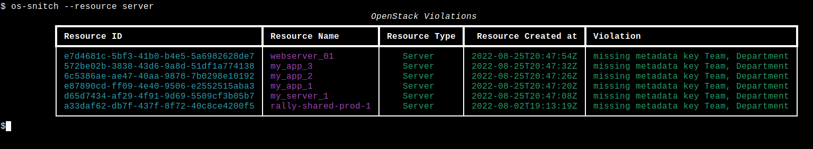
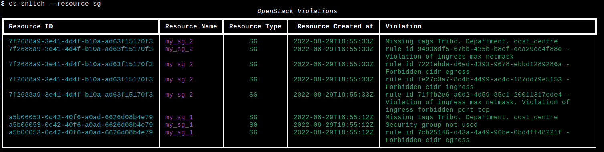

# os-snitch - OpenStack compliance rules checker


[](./LICENSE)
[](https://github.com/psf/black)


# About
os-snitch is a tool to check an OpenStack project (tenant) against compliance rules.

# How it works

os-snitch reads the compliance rules defined in the file *compliance_rules.yaml* and verifies the rules against an OpenStack project.
If any violation is found, it shows them on stdout or send them to an InfluxDB.

Compliance rules are defined in file *compliance_rules.yaml*. It can be customized for each environment.

```yaml
---
my_tenant_1:
  sg:
    mandatory_tags: ["Team", "Department"]
    alert_if_not_used: True
    ingress:
      forbid_cidrs: ["0.0.0.0/0", "192.168.10.0/24"]
      forbid_cidrs_exactly_match: False
      max_netmask_allowed: 16
      forbid_tcp_port: [20, 21, 23, 25, 137, 139, 445]
      forbid_udp_port: []
      max_number_port_per_rule: 2
      forbid_all_ports: True
      forbid_all_protocols: True
    egress:
      forbid_cidrs: ["0.0.0.0/0"]
      forbid_cidrs_exactly_match: False
    ignore_sg_ids:
      - 3f23dbb4-998e-4cf7-b996-08888ce2cfaf # default
  server:
    mandatory_tags: ["Team", "Department"]
    mandatory_metadata: []
my_tenant_2:
  sg:
    mandatory_tags: ["Department"]
  ...
```

# Example

```bash
$ os-snitch --help
$ os-snitch --debug --resource sg
$ os-snitch --resource sg
$ os-snitch --resource server
$ os-snitch --resource sg server
$ os-snitch --resource sg server --sendto influxdb
```




# Installation
```bash
$ pip install os-snitch
```

# Development mode
```bash
$ pip install -e .
```
